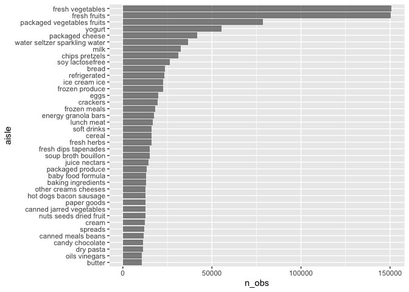
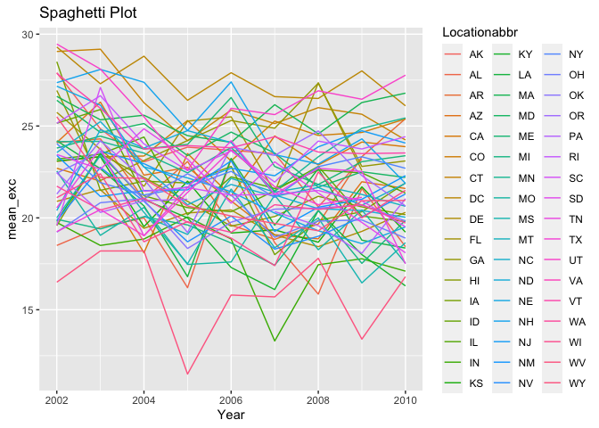
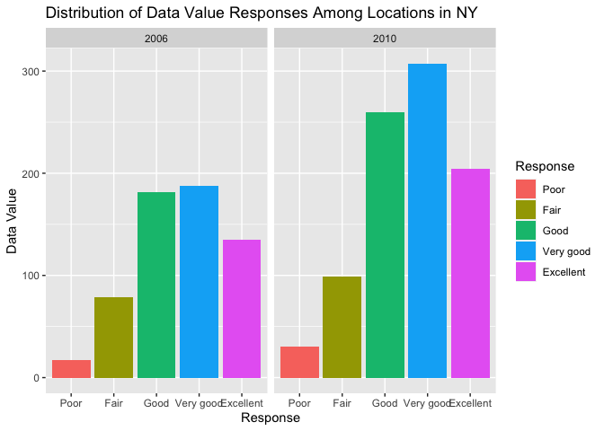
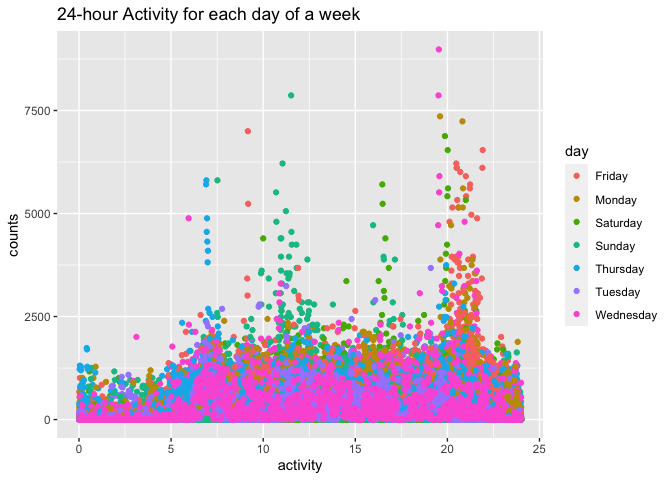

p8105\_hw3\_xm2276
================
XIAO MA
10/13/2021

``` r
#question is this leaflet necessary?
library(leaflet)
library(p8105.datasets)
library(tidyverse)
```

    ## ── Attaching packages ─────────────────────────────────────── tidyverse 1.3.1 ──

    ## ✓ ggplot2 3.3.5     ✓ purrr   0.3.4
    ## ✓ tibble  3.1.4     ✓ dplyr   1.0.7
    ## ✓ tidyr   1.1.3     ✓ stringr 1.4.0
    ## ✓ readr   2.0.1     ✓ forcats 0.5.1

    ## ── Conflicts ────────────────────────────────────────── tidyverse_conflicts() ──
    ## x dplyr::filter() masks stats::filter()
    ## x dplyr::lag()    masks stats::lag()

``` r
library(dplyr)
library(ggridges)
```

**Problem 1**

There are **1384617**observations of the dataset.  
There are **15 variables** of the dataset.  
The variables of the dataset are **order\_id, product\_id,
add\_to\_cart\_order, reordered, user\_id, eval\_set, order\_number,
order\_dow, order\_hour\_of\_day, days\_since\_prior\_order,
product\_name, aisle\_id, department\_id, aisle, department**.  
The **dimension of the dataset is 1384617, 15**.  
The **length of the dataset is 15**. The key variables are
‘reorded’,‘order\_hour\_of\_day’,‘days\_since\_prior\_order’,‘product\_name’

``` r
data("instacart")
janitor::clean_names(instacart)
```

    ## # A tibble: 1,384,617 × 15
    ##    order_id product_id add_to_cart_order reordered user_id eval_set order_number
    ##       <int>      <int>             <int>     <int>   <int> <chr>           <int>
    ##  1        1      49302                 1         1  112108 train               4
    ##  2        1      11109                 2         1  112108 train               4
    ##  3        1      10246                 3         0  112108 train               4
    ##  4        1      49683                 4         0  112108 train               4
    ##  5        1      43633                 5         1  112108 train               4
    ##  6        1      13176                 6         0  112108 train               4
    ##  7        1      47209                 7         0  112108 train               4
    ##  8        1      22035                 8         1  112108 train               4
    ##  9       36      39612                 1         0   79431 train              23
    ## 10       36      19660                 2         1   79431 train              23
    ## # … with 1,384,607 more rows, and 8 more variables: order_dow <int>,
    ## #   order_hour_of_day <int>, days_since_prior_order <int>, product_name <chr>,
    ## #   aisle_id <int>, department_id <int>, aisle <chr>, department <chr>

``` r
aisle1 = instacart %>% 
        count(aisle) %>%
        arrange(desc(n))
most_aisle = instacart %>%
  group_by(aisle) %>% 
  summarise(n_obs = n()) %>% 
  slice_max(n_obs)
##There are 134 aisles and 'Fresh Vegetables' are ordered most.
```

\#\#plot

``` r
aisle_numb = instacart %>%
  group_by(aisle) %>% 
  summarise(n_obs = n()) %>% 
  filter(n_obs > 10000) %>% 
  arrange(n_obs) %>% 
  mutate(aisle = forcats::fct_inorder(aisle))
ggplot(aisle_numb, aes(x = aisle, y = n_obs)) + geom_col(alpha = 0.7) + coord_flip() 
```

<!-- -->

\#\#Most 3 popular items

``` r
pop_item = instacart %>% 
  filter(aisle %in% c("baking ingredients","dog food care", "packaged vegetables fruits")) %>% 
  group_by(aisle, product_name) %>% 
  summarise(n_obs = n())
```

    ## `summarise()` has grouped output by 'aisle'. You can override using the `.groups` argument.

``` r
pop_item %>% mutate(order_rank = min_rank(desc(n_obs))) %>% 
  filter(order_rank < 4) %>% 
  arrange(aisle, order_rank) %>% 
  knitr::kable()
```

| aisle                      | product\_name                                 | n\_obs | order\_rank |
|:---------------------------|:----------------------------------------------|-------:|------------:|
| baking ingredients         | Light Brown Sugar                             |    499 |           1 |
| baking ingredients         | Pure Baking Soda                              |    387 |           2 |
| baking ingredients         | Cane Sugar                                    |    336 |           3 |
| dog food care              | Snack Sticks Chicken & Rice Recipe Dog Treats |     30 |           1 |
| dog food care              | Organix Chicken & Brown Rice Recipe           |     28 |           2 |
| dog food care              | Small Dog Biscuits                            |     26 |           3 |
| packaged vegetables fruits | Organic Baby Spinach                          |   9784 |           1 |
| packaged vegetables fruits | Organic Raspberries                           |   5546 |           2 |
| packaged vegetables fruits | Organic Blueberries                           |   4966 |           3 |

\#\#Mean hour

``` r
meanhour = instacart %>% 
  filter(product_name == "Pink Lady Apples" | product_name == "Coffee Ice Cream") %>% 
  group_by(aisle, order_dow) %>% 
  summarize(mean_hour = mean(order_hour_of_day, na.rm = TRUE), 2) %>% 
  mutate(order_dow, as.character(order_dow), 
         order_dow = replace(order_dow, 
                             order_dow == c("0","1","2","3","4","5","6"), 
                             c("Sun","Mon","Tues","Wed","Thur","Fri","Sat")))
```

    ## `summarise()` has grouped output by 'aisle'. You can override using the `.groups` argument.

``` r
meanhour %>% 
  ungroup() %>%
  pivot_wider(names_from = order_dow,
              values_from = mean_hour) %>% 
  knitr::kable()
```

| aisle         |   2 | as.character(order\_dow) |      Sun |      Mon |     Tues |      Wed |     Thur |      Fri |      Sat |
|:--------------|----:|:-------------------------|---------:|---------:|---------:|---------:|---------:|---------:|---------:|
| fresh fruits  |   2 | 0                        | 13.44118 |       NA |       NA |       NA |       NA |       NA |       NA |
| fresh fruits  |   2 | 1                        |       NA | 11.36000 |       NA |       NA |       NA |       NA |       NA |
| fresh fruits  |   2 | 2                        |       NA |       NA | 11.70213 |       NA |       NA |       NA |       NA |
| fresh fruits  |   2 | 3                        |       NA |       NA |       NA | 14.25000 |       NA |       NA |       NA |
| fresh fruits  |   2 | 4                        |       NA |       NA |       NA |       NA | 11.55172 |       NA |       NA |
| fresh fruits  |   2 | 5                        |       NA |       NA |       NA |       NA |       NA | 12.78431 |       NA |
| fresh fruits  |   2 | 6                        |       NA |       NA |       NA |       NA |       NA |       NA | 11.93750 |
| ice cream ice |   2 | 0                        | 13.77419 |       NA |       NA |       NA |       NA |       NA |       NA |
| ice cream ice |   2 | 1                        |       NA | 14.31579 |       NA |       NA |       NA |       NA |       NA |
| ice cream ice |   2 | 2                        |       NA |       NA | 15.38095 |       NA |       NA |       NA |       NA |
| ice cream ice |   2 | 3                        |       NA |       NA |       NA | 15.31818 |       NA |       NA |       NA |
| ice cream ice |   2 | 4                        |       NA |       NA |       NA |       NA | 15.21739 |       NA |       NA |
| ice cream ice |   2 | 5                        |       NA |       NA |       NA |       NA |       NA | 12.26316 |       NA |
| ice cream ice |   2 | 6                        |       NA |       NA |       NA |       NA |       NA |       NA | 13.83333 |

**Problem 2**

\#\#cleaning the data

``` r
data("brfss_smart2010")
BRFSS = brfss_smart2010 %>%
  filter(Topic == "Overall Health") %>%
  mutate(
    Response = factor(Response, levels = c("Poor","Fair","Good","Very good", "Excellent"))) %>% 
    arrange(Response)
```

\#\#In 2002, which states were observed at 7 or more locations? What
about in 2010?

``` r
year_2002 = filter(BRFSS, Year == '2002' ) %>%
  distinct(Locationabbr, Locationdesc) %>% 
   group_by(Locationabbr) %>%
   summarize(n_obs = n()) %>% 
   filter(n_obs >= 7)
year_2002
```

    ## # A tibble: 6 × 2
    ##   Locationabbr n_obs
    ##   <chr>        <int>
    ## 1 CT               7
    ## 2 FL               7
    ## 3 MA               8
    ## 4 NC               7
    ## 5 NJ               8
    ## 6 PA              10

``` r
#by observing the dataset, there are 6 states observed at 7 or more locations. They are CT,FL,MA,NC,NJ,PA,
year_2010 = filter(BRFSS, Year == '2010' ) %>%
   distinct(Locationabbr, Locationdesc) %>% 
   group_by(Locationabbr) %>%
   summarize(n_obs = n()) %>% 
   filter(n_obs >= 7)
year_2010
```

    ## # A tibble: 14 × 2
    ##    Locationabbr n_obs
    ##    <chr>        <int>
    ##  1 CA              12
    ##  2 CO               7
    ##  3 FL              41
    ##  4 MA               9
    ##  5 MD              12
    ##  6 NC              12
    ##  7 NE              10
    ##  8 NJ              19
    ##  9 NY               9
    ## 10 OH               8
    ## 11 PA               7
    ## 12 SC               7
    ## 13 TX              16
    ## 14 WA              10

``` r
#by observing the dataset, there are 14 states observed at 7 or more locations. They are CA,CO,FL,MA,MD,NC,NE,NJ,NY,OH,PA,SC,TX,WA
```

\#\#Spaghetti Plot

``` r
brfss_excellent = BRFSS %>% 
   mutate(Response = as.numeric(Response)) %>% 
   filter(Response == 5 ) %>%
   select(Year,Data_value, Locationabbr,Response) %>% 
   group_by(Year, Locationabbr) %>% 
   summarise(mean_exc = mean(Data_value))
```

    ## `summarise()` has grouped output by 'Year'. You can override using the `.groups` argument.

``` r
brfss_excellent
```

    ## # A tibble: 443 × 3
    ## # Groups:   Year [9]
    ##     Year Locationabbr mean_exc
    ##    <int> <chr>           <dbl>
    ##  1  2002 AK               27.9
    ##  2  2002 AL               18.5
    ##  3  2002 AR               24.1
    ##  4  2002 AZ               24.1
    ##  5  2002 CA               22.7
    ##  6  2002 CO               23.1
    ##  7  2002 CT               29.1
    ##  8  2002 DC               29.3
    ##  9  2002 DE               20.9
    ## 10  2002 FL               25.7
    ## # … with 433 more rows

``` r
#plot
ggplot(data = brfss_excellent, aes(x = Year, y = mean_exc, group = Locationabbr, color = Locationabbr)) + geom_line() + labs(title = "Spaghetti Plot")
```

    ## Warning: Removed 3 row(s) containing missing values (geom_path).

<!-- -->

\#\#Make a two-panel plot showing, for the years 2006, and 2010,
distribution of data\_value for responses (“Poor” to “Excellent”) among
locations in NY State.

``` r
plot_df =  BRFSS %>% 
  filter(Year == "2006" | Year == "2010", Locationabbr == "NY") %>% 
  group_by(Year,Response)

ggplot(plot_df, aes(x = Response, y = Data_value, fill = Response)) + geom_col() + facet_grid(.~Year) + 
  labs(x = "Response",
       y = "Data Value",
       title = "Distribution of Data Value Responses Among Locations in NY")
```

<!-- -->

**Problem 3**

\#\#Load, tidy, and otherwise wrangle the data. Your final dataset
should include all originally observed variables and values; have useful
variable names; include a weekday vs weekend variable; and encode data
with reasonable variable classes. Describe the resulting dataset
(e.g. what variables exist, how many observations, etc).

``` r
accel_df = read_csv("data/accel_data.csv")
```

    ## Rows: 35 Columns: 1443

    ## ── Column specification ────────────────────────────────────────────────────────
    ## Delimiter: ","
    ## chr    (1): day
    ## dbl (1442): week, day_id, activity.1, activity.2, activity.3, activity.4, ac...

    ## 
    ## ℹ Use `spec()` to retrieve the full column specification for this data.
    ## ℹ Specify the column types or set `show_col_types = FALSE` to quiet this message.

``` r
accel_df %>% 
  janitor::clean_names()
```

    ## # A tibble: 35 × 1,443
    ##     week day_id day       activity_1 activity_2 activity_3 activity_4 activity_5
    ##    <dbl>  <dbl> <chr>          <dbl>      <dbl>      <dbl>      <dbl>      <dbl>
    ##  1     1      1 Friday          88.4       82.2       64.4       70.0       75.0
    ##  2     1      2 Monday           1          1          1          1          1  
    ##  3     1      3 Saturday         1          1          1          1          1  
    ##  4     1      4 Sunday           1          1          1          1          1  
    ##  5     1      5 Thursday        47.4       48.8       46.9       35.8       49.0
    ##  6     1      6 Tuesday         64.8       59.5       73.7       45.7       42.4
    ##  7     1      7 Wednesday       71.1      103.        68.5       45.4       37.8
    ##  8     2      8 Friday         675        542       1010        779        509  
    ##  9     2      9 Monday         291        335        393        335        263  
    ## 10     2     10 Saturday        64         11          1          1          1  
    ## # … with 25 more rows, and 1,435 more variables: activity_6 <dbl>,
    ## #   activity_7 <dbl>, activity_8 <dbl>, activity_9 <dbl>, activity_10 <dbl>,
    ## #   activity_11 <dbl>, activity_12 <dbl>, activity_13 <dbl>, activity_14 <dbl>,
    ## #   activity_15 <dbl>, activity_16 <dbl>, activity_17 <dbl>, activity_18 <dbl>,
    ## #   activity_19 <dbl>, activity_20 <dbl>, activity_21 <dbl>, activity_22 <dbl>,
    ## #   activity_23 <dbl>, activity_24 <dbl>, activity_25 <dbl>, activity_26 <dbl>,
    ## #   activity_27 <dbl>, activity_28 <dbl>, activity_29 <dbl>, …

``` r
accel_df_tidy = pivot_longer(accel_df,
               activity.1:activity.1440,
               names_to = "activity",
               names_prefix = "activity.",
               values_to = "counts"
               ) %>% 
  mutate(weekday_vs_weekend = case_when(
    day == "Monday"~"weekday",
    day == "Tuesday" ~ "weekday",
    day == "Wednesday" ~ "weekday",
    day == "Thursday" ~ "weekday",
    day == "Friday" ~ "weekday",
    day == "Saturday" ~ "weekend",
    day == "Sunday" ~ "weekend"),
    week = as.numeric(as.character(week)))
```

The variables of the dataset are **week, day\_id, day, activity, counts,
weekday\_vs\_weekend**, there are **`nrow(accel_ds_tidy)`**
observations.

\#\#Traditional analyses of accelerometer data focus on the total
activity over the day. Using your tidied dataset, aggregate accross
minutes to create a total activity variable for each day, and create a
table showing these totals. Are any trends apparent?

``` r
accel_df_tidy %>% 
  group_by(day_id) %>% 
  mutate(total_activity = sum(counts)) %>% 
  ungroup() %>% 
  select(week, day, total_activity) %>%
  distinct() %>% 
  pivot_wider(
    names_from = "day",
    values_from = "total_activity")
```

    ## # A tibble: 5 × 8
    ##    week  Friday  Monday Saturday Sunday Thursday Tuesday Wednesday
    ##   <dbl>   <dbl>   <dbl>    <dbl>  <dbl>    <dbl>   <dbl>     <dbl>
    ## 1     1 480543.  78828.   376254 631105  355924. 307094.   340115.
    ## 2     2 568839  295431    607175 422018  474048  423245    440962 
    ## 3     3 467420  685910    382928 467052  371230  381507    468869 
    ## 4     4 154049  409450      1440 260617  340291  319568    434460 
    ## 5     5 620860  389080      1440 138421  549658  367824    445366

\#\#Accelerometer data allows the inspection activity over the course of
the day. Make a single-panel plot that shows the 24-hour activity time
courses for each day and use color to indicate day of the week. Describe
in words any patterns or conclusions you can make based on this graph.

``` r
accel_df_tidy %>% 
  mutate(
    activity = as.numeric(activity),
    activity = activity / 60) %>% 
  ggplot(aes(x = activity, y = counts, color = day)) + geom_point() +
  labs(title = "24-hour Activity for each day of a week")
```

<!-- --> By
observing the plot, we find that in the early morning, the activities
are not that active as in the mid or evening of the day. There are two
peak of activities around 12th and 20th hour. The highest point is on
Wednesday around 19th hour.
